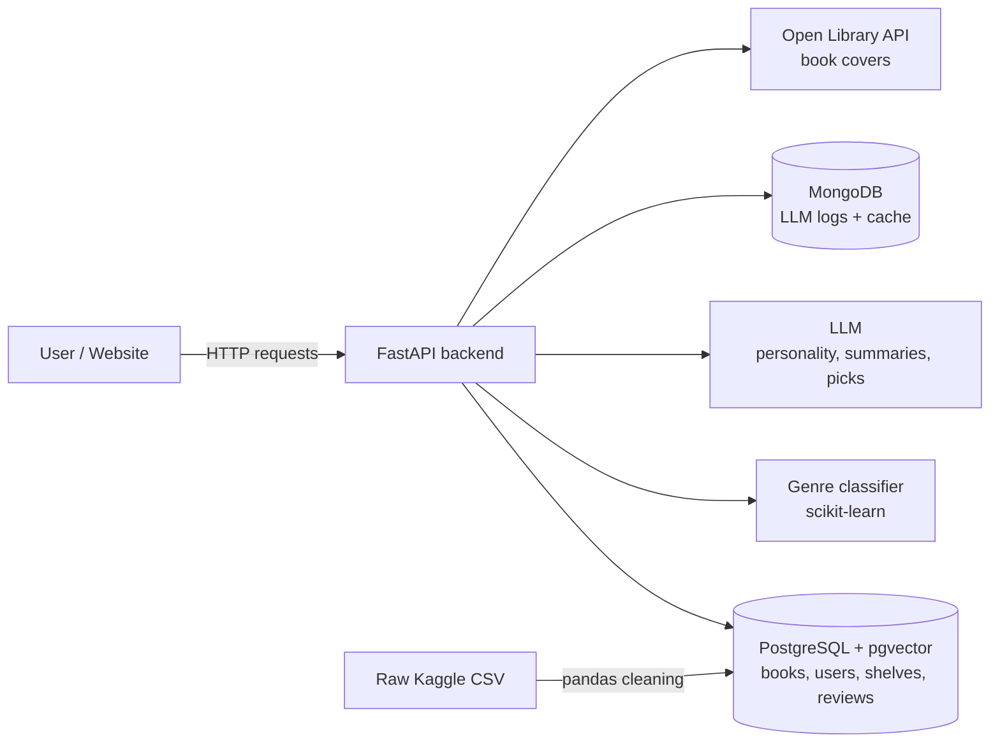

# 📚 ShelfLife

> An AI-powered book discovery backend: search books, build your bookshelf, and get recommendations that match a *vibe*, like "a book that feels like a rainy afternoon."
---

## 🤔 What is this?

ShelfLife is the **backend** (the "kitchen") of a book app. It lets users:

- 🔎 **Search** thousands of real books by title, author, genre, or rating
- 📖 **Build a bookshelf** with three shelves: *Want to Read*, *Reading*, *Read*
- ⭐ **Write reviews** and see reading stats
- 🏷️ **Auto-tag genres**: a machine learning model reads a book's description and guesses its genre
- 🧠 **Get a "reading personality"**: an AI looks at what you read and describes you as a reader
- ✨ **Ask for recommendations in plain English**: "a cozy mystery in a small town" returns real books from our database, with reasons why

The frontend (the website people click on) will be added later. For now, everything can be tested from the interactive API docs page.

---

## 🍽️ How it works (the restaurant version)

| Restaurant | ShelfLife | Tech |
|---|---|---|
| The dining room & menu | The website users see | Next.js *(later)* |
| The waiter taking orders | Carries requests between website and kitchen | **API** (FastAPI) |
| The kitchen | Where the real work happens | **Backend** (Python) |
| The pantry | Where all the books, users and shelves are stored | **Database** (PostgreSQL via Supabase) |
| The order notebook | Notes on every AI request we made | **MongoDB** |
| Washing & sorting groceries | Cleaning the raw book data | **pandas** |
| A chef who learned by tasting 10,000 dishes | Guesses a book's genre from its description | **Machine Learning** (scikit-learn) |
| A friend who read the whole internet | Writes reader personalities & explanations | **LLM** (Large Language Model) |
| That friend checking *our* shelves before answering | Recommends only real books we actually have | **RAG** (Retrieval-Augmented Generation) |
| A map where books with similar vibes sit close together | How we search by meaning instead of exact words | **Embeddings + pgvector** |

---

## 🏗️ Architecture



**RAG recommendation flow:**

```
"a book that feels like a rainy afternoon"
   → turn the question into an embedding (numbers that capture meaning)
   → find the closest books in PostgreSQL (pgvector)
   → give those books to the LLM: "pick from ONLY these"
   → return 3 real recommendations + why each fits
```

---

## 🧰 Tech Stack

| Area | Tool | What it does here |
|---|---|---|
| Language | Python 3.11+ | Everything backend |
| Data | pandas, Jupyter | Clean & explore the book dataset |
| Database | PostgreSQL (Supabase) | Books, users, shelves, reviews |
| Vector search | pgvector | Search books by meaning |
| NoSQL | MongoDB Atlas | Log & cache AI responses |
| ML | scikit-learn | Genre prediction from descriptions |
| Embeddings | sentence-transformers | Turn text into meaning-numbers |
| LLM | Gemini / OpenAI / Claude / Ollama | Generate text & recommendations |
| API | FastAPI + Pydantic | Endpoints, validation, docs |
| External API | Open Library | Book covers & extra info |
| Testing | pytest | Make sure things don't break |
| Deploy | Docker + Render | Put it on the internet |

---

## 📁 Project Structure

```
shelflife/
├── data/            raw/ and clean/ book data
├── notebooks/       exploration & model training
├── scripts/         one-time jobs (load data, create embeddings)
├── app/
│   ├── main.py      starts the API
│   ├── config.py    reads secrets from .env
│   ├── db.py        database connections
│   ├── schemas.py   shapes of data going in & out
│   ├── routers/     groups of endpoints (books, users, shelves...)
│   └── services/    helpers (LLM, ML, RAG, Open Library)
├── ml/              saved ML model
├── tests/           automated tests
├── .env             secrets: NEVER committed
├── requirements.txt Python packages
└── Dockerfile       container setup
```

---

## 🗺️ 7-Day Roadmap

- [ ] **Day 1: pandas.** Load, clean, and explore the book dataset
- [ ] **Day 2: SQL + Supabase.** Design tables, load data, write 10 real queries
- [ ] **Day 3: FastAPI.** REST endpoints, validation, pagination, Open Library API
- [ ] **Day 4: Machine Learning.** Train & serve a genre classifier
- [ ] **Day 5: LLM + MongoDB.** Reader personality, review summaries, logging & caching
- [ ] **Day 6: RAG.** Embeddings, vector search, hybrid search, AI recommendations
- [ ] **Day 7: Production.** Auth, tests, Docker, deploy, polish

---

## 📖 Glossary (plain English)

- **Backend:** the part of an app users don't see; it stores data and does the thinking.
- **API:** a set of URLs the website can call to ask the backend for things (e.g. `GET /books?q=dune`).
- **Endpoint:** one of those URLs.
- **Database:** organized long-term storage for data.
- **SQL:** the language for asking a database questions ("give me all fantasy books rated above 4").
- **Table / Row / Column:** like a spreadsheet: a sheet, a line, a heading.
- **Foreign key:** a column that points to a row in another table (a shelf item points to a user and a book).
- **NoSQL / MongoDB:** a database that stores flexible JSON-like documents instead of strict tables.
- **pandas:** a Python library for working with tables of data, like Excel in code.
- **Machine Learning (ML):** teaching a computer by showing it many examples instead of writing rules by hand.
- **Training:** the computer studying examples to find patterns.
- **Model:** the saved result of training, the "brain" you can ask questions.
- **Features / Label:** the clues (description text) and the answer (genre).
- **Accuracy:** how often the model is right on examples it has never seen.
- **LLM:** a huge AI model trained on lots of text that can read and write (ChatGPT, Claude, Gemini).
- **Prompt:** the instructions/text you send to an LLM.
- **Embedding:** a list of numbers representing the *meaning* of text; similar meanings → similar numbers.
- **Vector database:** a database that can find the closest embeddings quickly.
- **RAG:** Retrieval-Augmented Generation: find relevant info first, then have the LLM answer using only that info.
- **JSON:** a common text format for data: `{"title": "Dune", "rating": 4.3}`.
- **Environment variables / .env:** where secrets like API keys live, outside the code.
- **Git / GitHub:** save points for your code / an online home for those save points.

---

## 🚀 Getting Started

*Setup instructions will be added as the project is built.*

---

## 📝 Learning Log

*Notes, mistakes, and lessons from each day go here.*

| Day | What I learned | What was hard |
|---|---|---|
| 1 | | |
| 2 | | |
| 3 | | |
| 4 | | |
| 5 | | |
| 6 | | |
| 7 | | |

---

## 🙏 Data & Credits

- Book data: *Goodreads Best Books Ever* dataset (Kaggle)
- Book covers: [Open Library](https://openlibrary.org/developers/api)
